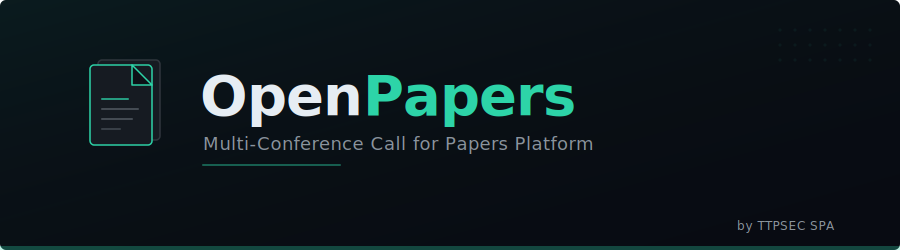
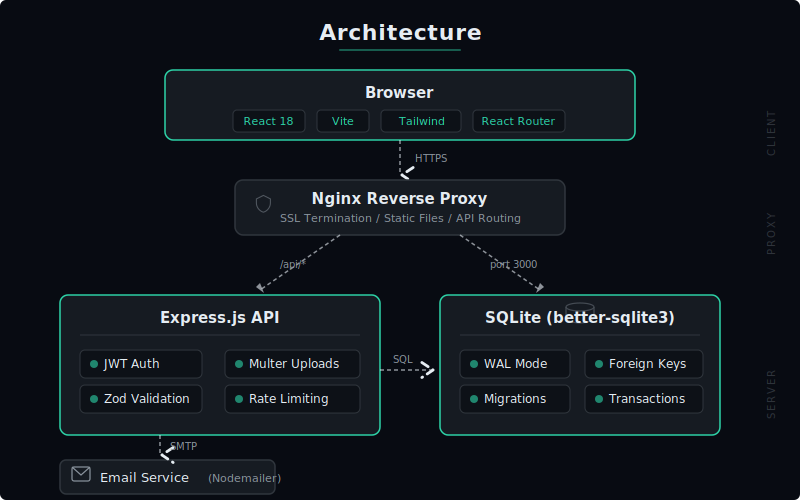

<p align="center">
  
</p>

<h1 align="center">OpenPapers by TTPSEC SPA</h1>

<p align="center">
  Plataforma multi-conferencia de Call for Papers de código abierto.
</p>

<p align="center">
  <a href="LICENSE"></a>
  
  
  
</p>

---

## ✨ Características

- **Multi-conferencia** — gestiona múltiples conferencias desde un solo panel.
- **Tracks temáticos** — organiza envíos por áreas o líneas de investigación.
- **Revisión por pares** — asignación de revisores con detección de conflicto de interés y revisión doble ciego.
- **Seguimiento público** — los autores consultan el estado con un código de seguimiento (sin crear cuenta).
- **Notificaciones por email** — confirmación de envío, asignación de revisión, decisión (aceptación / rechazo / revisión).
- **Dashboard completo** — estadísticas, log de emails, gestión de usuarios, configuración SMTP.
- **Despliegue Docker** — `docker compose up` y listo.

## 🏗️ Arquitectura

<p align="center">
  
</p>

| Capa | Tecnología |
|------|------------|
| Frontend | React 18 · Vite 6 · Tailwind CSS · React Router 6 |
| Backend | Node.js 20 · Express 4 · Zod · JWT |
| Base de datos | SQLite (better-sqlite3) |
| Email | Nodemailer (SMTP) |
| Proxy | Nginx |
| Contenedores | Docker Compose |

## 🚀 Inicio rápido

### Prerrequisitos

- [Node.js](https://nodejs.org/) ≥ 20
- npm ≥ 10

### 1. Clonar el repositorio

```bash
git clone https://github.com/ttpsec/openpapers.git
cd openpapers
```

### 2. Configurar variables de entorno

```bash
cp .env.example .env
# Edita .env con tus valores (JWT secrets, SMTP, admin, etc.)
```

### 3. Instalar dependencias

```bash
cd backend && npm install && cd ..
cd frontend && npm install && cd ..
```

### 4. Iniciar en desarrollo

```bash
# Terminal 1 — backend (puerto 3001)
cd backend && npm run dev

# Terminal 2 — frontend (puerto 5173)
cd frontend && npm run dev
```

Abre [http://localhost:5173](http://localhost:5173) en tu navegador.

> El seed automático creará un usuario administrador con las credenciales de `.env`.

### 5. Despliegue con Docker

```bash
docker compose up -d
```

El sitio estará disponible en el puerto 80 a través de Nginx.

## 📁 Estructura del proyecto

```
openpapers/
├── backend/
│   └── src/
│       ├── config.js            # Configuración (env)
│       ├── index.js             # Punto de entrada Express
│       ├── database/
│       │   ├── init.js          # Inicialización SQLite
│       │   ├── schema.sql       # DDL de tablas
│       │   └── seeds.js         # Datos iniciales
│       ├── middleware/
│       │   ├── auth.js          # JWT authenticate / authorize
│       │   ├── upload.js        # Multer (solo PDF)
│       │   └── validate.js      # Validación con Zod
│       ├── routes/
│       │   ├── auth.routes.js   # Login, registro, refresh
│       │   ├── conferences.routes.js
│       │   ├── public.routes.js
│       │   ├── reviews.routes.js
│       │   └── submissions.routes.js
│       ├── services/
│       │   ├── assignment.js    # Auto-asignación de revisores
│       │   ├── mailer.js        # Plantillas y envío SMTP
│       │   └── stats.js         # Estadísticas
│       └── utils/
│           ├── errors.js        # Clases de error
│           └── helpers.js       # Utilidades (tracking code)
├── frontend/
│   └── src/
│       ├── api/client.js        # Fetch wrapper con JWT refresh
│       ├── context/AuthContext.jsx
│       ├── layouts/             # PublicLayout, DashboardLayout
│       ├── pages/               # Páginas públicas y dashboard
│       └── utils/formatDate.js  # Formateo de fechas (es-ES)
├── nginx/default.conf
├── docker-compose.yml
├── .env.example
└── assets/                      # SVG: banner, logo, arquitectura
```

## 🔒 Modelo de roles

| Rol | Permisos |
|-----|----------|
| **superadmin** | Todo: conferencias, usuarios, configuración global |
| **admin** | Gestionar conferencias donde es chair |
| **reviewer** | Ver papers asignados, enviar revisiones |
| **author** | Enviar papers (sin cuenta, vía formulario público) |

## 📧 Flujo de emails

1. **Confirmación de envío** → al autor al recibir el paper.
2. **Asignación de revisión** → al revisor cuando se le asigna un paper.
3. **Decisión** → al autor con la decisión (aceptado / rechazado / revisión solicitada) y comentarios de revisores.

## 🔑 Variables de entorno

| Variable | Descripción | Ejemplo |
|----------|-------------|---------|
| `NODE_ENV` | Entorno | `production` |
| `PORT` | Puerto del backend | `3001` |
| `JWT_SECRET` | Secreto para access tokens | (64 chars aleatorios) |
| `JWT_REFRESH_SECRET` | Secreto para refresh tokens | (64 chars aleatorios) |
| `DB_PATH` | Ruta de la base de datos | `./data/openpapers.db` |
| `SMTP_HOST` | Servidor SMTP | `smtp.gmail.com` |
| `SMTP_PORT` | Puerto SMTP | `587` |
| `SMTP_USER` | Usuario SMTP | `cfp@tuconferencia.cl` |
| `SMTP_PASS` | Contraseña SMTP | (app password) |
| `ADMIN_EMAIL` | Email del admin inicial | `admin@tuconferencia.cl` |
| `ADMIN_PASSWORD` | Contraseña del admin inicial | (cambiar) |
| `APP_URL` | URL pública de la aplicación | `https://cfp.tuconferencia.cl` |

> Ver `.env.example` para la lista completa.

## 🤝 Contribuir

Las contribuciones son bienvenidas. Consulta [CONTRIBUTING.md](CONTRIBUTING.md) para más detalles.

## 📄 Licencia

Este proyecto está bajo la licencia [MIT](LICENSE).

---

<p align="center">
  <br/>
  Hecho con ❤️ por <strong>TTPSEC SPA</strong>
</p>
